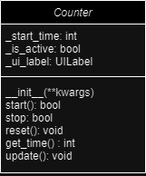

# Counter

__init(**kwargs) - klasa przyjmuje elementy takie jak UILabel i za pomocą ich tworzy UILabel, dodatwowo ustawia Counter w stan początkowy nie włączony

start() - Włącza licznik, zwraca true jeśli wcześniej był nie włączony, jeżeli był włączny nic nie zmienia

stop() - Wyłącza licznik zwraca true jeśli był wcześniej włączony

reset() - wyłacza licznik i go zeruje

get_time() - podaje aktulany czas w sekundach

update() aktualizuje UILabel