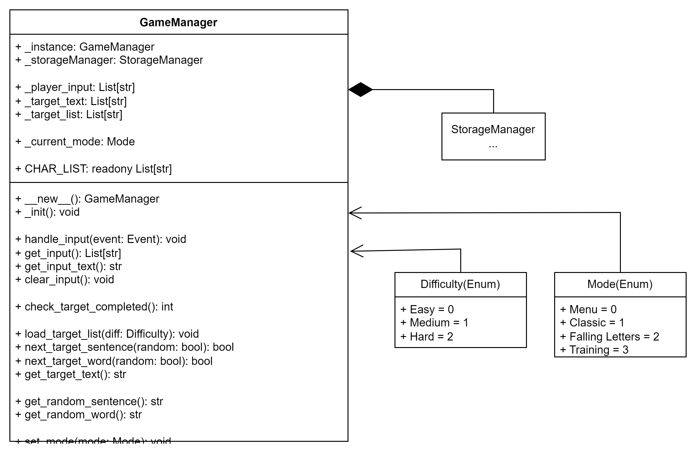

## GameManager

[!TIP]
target = zdanie/słowo do wpisania

\_\_new__() - tworzy singleton i wywołuje konstruktor

_init() - konstruktor 

handle_inptut() - odczytuje wpisany teks z otrzymanego eventu i dodaje go do zmiennej _player_input

get_input() - zwraca zawartość zmiennej _player_input

clear_input() - usuwa dane przechowywane w zmiennej _player_input

check_target_completed() - sprawdza czy wpisane przez gracza słowo zgadza się z ze słowem target, jeżeli tak to czyści input i wczytuje nowy target (dodaje punkty ?)

load_target_list() - wczytuje listę słów do wpisywania

next_target_sentence() - wczytuje nowe zdanie jako target, usuwa zdanie z puli _target_list, zwraca False jeżeli _target_list jest pusty

next_target_word() - wczytuje nowe słowo jako target, usuwa słowo z puli ?, zwraca False jeżeli _target_list jest pusty

get_random_sentence() - zwraca losowe zdanie z _target_list

get_random_word() - zwraca losowe słowo z _target_list

[!IMPORTANT]
Metody get_random_... nie usuwają zdania/słowa z puli targetów

set_mode() - ustawia aktualny tryb gry od którego zależeć będzie funkcjonalność większości metod 

get_target_text() - zwraca aktualną wartość _target_text