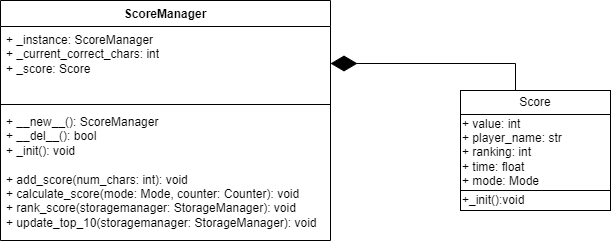

# ScoreManager

 
_current_correct_chars: int - aktualna ilość poprawnie wpisanych znaków obliczona w GameManager

add_score(num_char) - zwiększa wartość pola _current_correct_chars

calculate_score(mode, counter) - oblicza ilość punktów w zależności od trybu i czasu, wynik umieszcza w polu _score

rank_score(storagemanager) - nadaje nowemu wynikowi pozycję w rankingu porównując go z poprzednimi wynikami

update_top_10(storagemanegar) - w przypadku gdy wynik zostaje oceniony jako jeden z 10 najwyższych, aktualizuje listę 10 najlepszych wyników

__del__() - destruktor, zwraca czy pomyślnie usunięty

## Score

_init() - konstruktor tworzący obiekt Score z wartościami domyślnymi
