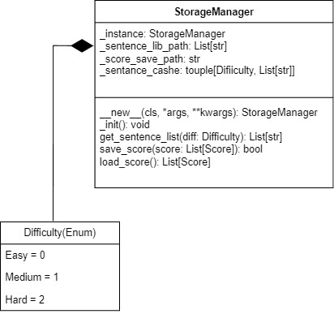

# StorageManager

\_\_new__() - sprawdza czy istnieje instancja klasy, jeżeli tak to ją zwraca jeżeli nie to tworzy nową i ją zwraca

_init() - inicjalizuje obiekt klasy

get_sentance_list(diff) - sprawdza czy lista ze zdaniami o danej trudności znajduje się w cashu i ją zwraca. Jeżeli się w   nim nie znajduje wczytuje listę z pliku nadpisuje cashe i zwraca listę.

save_score(score) - zapisuje listę obiektów typu Score w formacie json

load_score() - zwraca listę obiektów typu score zapisanych w pliku json

# Difficulty

Enumerator będący listą dostępnych trybów trudności

# Score
TODO:
- [ ] Score - Obiekt przechowujący pojedyczy wynik zdobyty przez gracza
