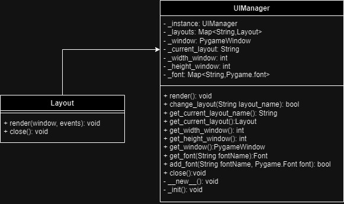

## UI Manager

render() - Ta funkcja będzie posiadała główną pętlę programu, pobiera listę eventów i odpala render z aktulanego layoutu, zakańcza pętlę w momencie kiedy isRunning jest false. Na początku ustawia flagę isRunnning na true

change_layout(String layout_name) - zmienia aktualny layout i zwraca true jeżeli się udało. Jeżeli nazwa layoutu jest nie poprawna zwraca false

get_current_layout_name() - zwraca aktualną nazwę layoutu

get_current_layout() - zwraca aktulany obiekt layout

get_width_window() - zwraca szerokość okna

get_height_window() - zwraca wysokość okna

get_window() - Zwraca obiekt okna

get_font() - Zwraca szukany font, w przypadku nie znalezienia zwraca błąd

add_font - dodaje Font do bazy fontów, jeżeli taki font istnieje zwraca false

get_delta_time() - Zwraca czas pomiędzy klatkami

close() - zamyka aplikacje,wywołuje close na aktualnym Layoucie, ustawia flagę isRunning na false. 

__new__() - funkcja która sprawdza czy nie istnieje już obiekt tej klasy, jeżeli nie to tworzy obiekt.
Zwraca obiekt klasy UIManager

_init() - Tworzy obiekt UIManager, tworzy listę layoutów, generuje okno aplikacji

## Layout
render(window, event) - główna funkcja programu wykonująca całe działanie layoutu, reaguje na eventy
close() - funkcja zamykająca wszystkie otwarte elementy