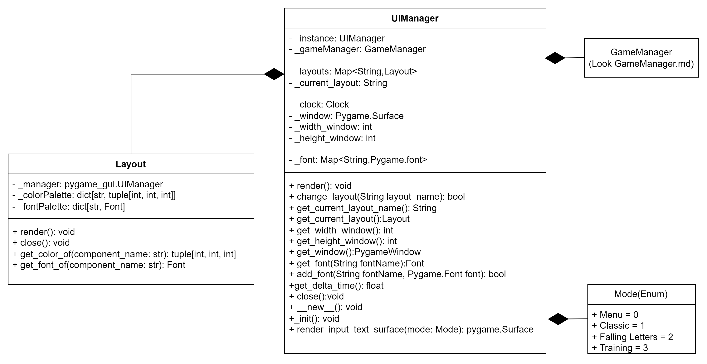

## UI Manager

render() - Ta funkcja będzie posiadała główną pętlę programu, pobiera listę eventów i odpala render z aktulanego layoutu, zakańcza pętlę w momencie kiedy isRunning jest false. Na początku ustawia flagę isRunnning na true

changeLayout(String layout_name) - zmienia aktualny layout i zwraca true jeżeli się udało. Jeżeli nazwa layoutu jest nie poprawna zwraca false

getCurrentLayoutName() - zwraca aktualną nazwę layoutu

getCurrentLayout() - zwraca aktulany obiekt layout

getWidthWindow() - zwraca szerokość okna

getHeightWindow() - zwraca wysokość okna

getWindow() - Zwraca obiekt okna

close() - zamyka aplikacje, ustawia flagę isRunning na false. 

__new__() - funkcja która sprawdza czy nie istnieje już obiekt tej klasy, jeżeli nie to tworzy obiekt.
Zwraca obiekt klasy UIManager

_init() - Tworzy obiekt UIManager, tworzy listę layoutów, generuje okno aplikacji
